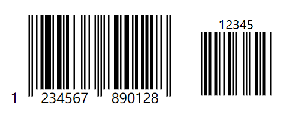

## cnf-barcode
----------------------------
author: bugszhou | Email:bugszhou@outlook.com <br>
description: a barcode generator

本库基于JsBarcode核心库修改，仅生成svg格式图片和svg的base64文本，主要用于非标准dom和无dom结构中使用。

- **支持生成不同颜色的一维码**

[查看JsBarcode](https://www.npmjs.com/package/jsbarcode)

Introduction
----
**cnf-barcode** is a **barcode generator** written in JavaScript. It supports multiple barcode formats and works in browsers and with *Node.js*. It has *no dependencies* when it is used for the web but works with *jQuery* if you are into that.


Demo
----

Supported barcodes:
----
* CODE128
  * CODE128 (automatic mode switching)
  * CODE128 A/B/C (force mode)
* EAN
  * EAN-13
  * EAN-8
  * EAN-5
  * EAN-2
  * UPC (A)
  * UPC (E)
* CODE39
* ITF
  * ITF
  * ITF-14
* MSI
  * MSI10
  * MSI11
  * MSI1010
  * MSI1110
* Pharmacode
* Codabar

#### getSvgBase64

```javascript
let barcode = cnfBarcode("Hi!").getSvgBase64();
```

Examples for browsers:
----

#### Simple example:
````javascript
let barcode = cnfBarcode("Hi!").getSvg();
// or use base64
let barcode = cnfBarcode("Hi!").getSvgBase64();
````

#### Example with options:
````javascript
cnfBarcode("1234", {
  format: "pharmacode",
  lineColor: "#f4a460",
  width:4,
  height:40,
  displayValue: false
});
````
##### Result:


#### More advanced use case:
````javascript
let barcode = cnfBarcode().options({font: "OCR-B"}) // Will affect all barcodes
      .EAN13("1234567890128", {fontSize: 18, textMargin: 0})
      .blank(20) // Create space between the barcodes
      .EAN5("12345", {height: 85, textPosition: "top", fontSize: 16, marginTop: 15})
      .render().getSvg();
````
##### Result:


Bower and npm:
----
You can also use [Bower](http://bower.io) or [npm](https://www.npmjs.com) to install and manage the library.
````bash
bower install cnf-barcode --save
````
````bash
npm install cnf-barcode --save
````

Options:
----
For information about how to use the options, see [the wiki page](https://github.com/lindell/JsBarcode/wiki/Options).

| Option | Default value | Type |
|--------|---------------|------|
| [`format`](https://github.com/lindell/JsBarcode/wiki/Options#format) | `"auto" (CODE128)` | `String` |
| [`width`](https://github.com/lindell/JsBarcode/wiki/Options#width) | `2` | `Number` |
| [`height`](https://github.com/lindell/JsBarcode/wiki/Options#height) | `100` | `Number` |
| [`displayValue`](https://github.com/lindell/JsBarcode/wiki/Options#display-value) | `true` | `Boolean` |
| [`text`](https://github.com/lindell/JsBarcode/wiki/Options#text) | `undefined` | `String` |
| [`fontOptions`](https://github.com/lindell/JsBarcode/wiki/Options#font-options) | `""` | `String` |
| [`font`](https://github.com/lindell/JsBarcode/wiki/Options#font) | `"monospace"` | `String` |
| [`textAlign`](https://github.com/lindell/JsBarcode/wiki/Options#text-align) | `"center"` | `String` |
| [`textPosition`](https://github.com/lindell/JsBarcode/wiki/Options#text-position) | `"bottom"` | `String` |
| [`textMargin`](https://github.com/lindell/JsBarcode/wiki/Options#text-margin) | `2` | `Number` |
| [`fontSize`](https://github.com/lindell/JsBarcode/wiki/Options#font-size) | `20` | `Number` |
| [`background`](https://github.com/lindell/JsBarcode/wiki/Options#background)  | `"#ffffff"` | `String (CSS color)` |
| [`lineColor`](https://github.com/lindell/JsBarcode/wiki/Options#line-color) | `"#000000"` | `String (CSS color)` |
| [`margin`](https://github.com/lindell/JsBarcode/wiki/Options#margins) | `10` | `Number` |
| [`marginTop`](https://github.com/lindell/JsBarcode/wiki/Options#margins) | `undefined` | `Number` |
| [`marginBottom`](https://github.com/lindell/JsBarcode/wiki/Options#margins) | `undefined` | `Number` |
| [`marginLeft`](https://github.com/lindell/JsBarcode/wiki/Options#margins) | `undefined` | `Number` |
| [`marginRight`](https://github.com/lindell/JsBarcode/wiki/Options#margins) | `undefined` | `Number` |
| [`valid`](https://github.com/lindell/JsBarcode/wiki/Options#valid) | `function(valid){}` | `Function` |
